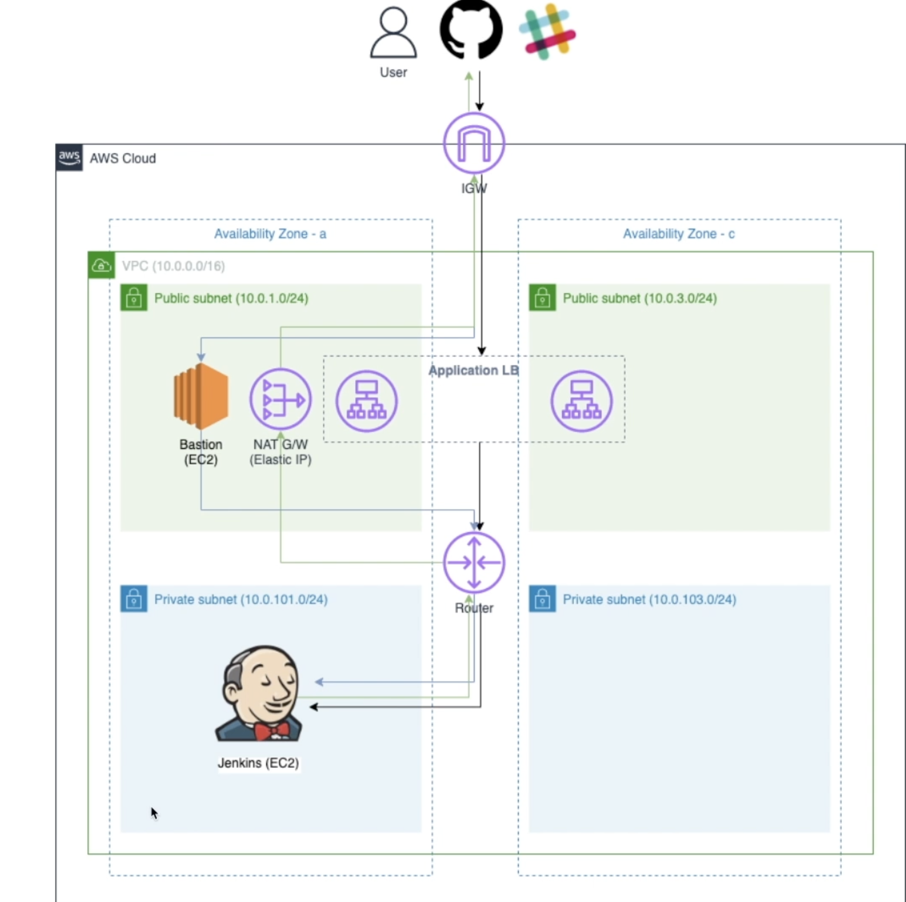

# Jenkins Pipeline



> Terraform Backend

- gloabl.tfvars로 region을 구별합니다.

```
terraform init -backend-config="../../gb.tfvars"
terraform workspace new [version]

terraform plan -var-file="path to gb.tfvars"
terraform apply -var=file="path to gb.tfvars"

```

> Init Stpe

```
    > network/private-vpc
    > ec2/bastion
    > alb/jenkins-alb
    ...

    추후 golang으로 자동화 pipeline 구성해야 함
```

> Todo (Infra)

- [x] Init VPC Setting
- [x] Basiton host (Public)
- [x] ALB use Jenkins
- [x] Jenkins (Private)
- [ ] Init Jenkins (Ansible)
- [ ] Total Pipeline Managment use golang
- [ ] CiCD

> Todo (Task)

- [ ] S3 Cleaner
- [ ] Flow Entire Infra
